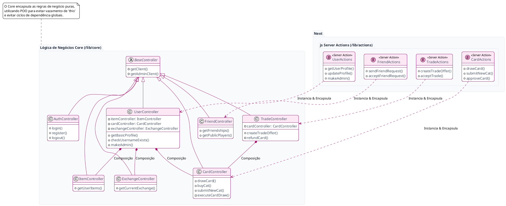

# Arquitetura do Backend (Next.js Server Actions + POO)

O backend do Catcha foi desenhado para ser robusto, escalável e fortemente tipado. Toda a lógica de negócios e persistência de dados está localizada em `/lib`, que atua como ponte segura entre a Interface de Usuário (UI) e o banco de dados Supabase. 

Recentemente, o backend passou por uma grande refatoração utilizando **Programação Orientada a Objetos (POO)** para lidar melhor com injeção de dependências, isolamento de escopo e encapsulamento.

## Estrutura de Pastas

1. **`/lib/core/`**: Contém o coração da aplicação. Aqui ficam as **Classes** de Controladores que herdam do `BaseController`. Essas classes contêm métodos puros (`public async`) e propriedades (`private`), garantindo um estado bem definido para execução da lógica e manipulação de recursos.
2. **`/lib/actions/`**: Contém os arquivos marcados com `'use server'`. Eles importam e instanciam as classes do `core` e exportam funções wrappers estáticas para serem consumidas diretamente pelos Client Components (React).

---

## Diagrama de Classes e Arquitetura

O diagrama abaixo apresenta o modelo arquitetural do backend, detalhando o relacionamento de herança, injeção de classes (composição) e a camada de funções exportadas para o Frontend (Server Actions).

## Módulos Principais

### 1. BaseController (O Alicerce)
Classe abstrata base para todos os controladores no Core. Fornece métodos utilitários, tratamento de erros padrão e métodos dinâmicos (`getClient()`, `getAdminClient()`), assegurando que todos os controladores derivados operem sob a mesma instância segura atrelada aos cookies da requisição.

### 2. Padrão de Composição (Injeção de Instâncias)
Controladores complexos como `UserController` e `TradeController` possuem propriedades privadas que são instâncias de outros controladores (ex: `this.itemController`). O `BaseController` permite uma modularização total e isolada no ciclo de requisição. Isso resolve problemas clássicos de escopo (`this` sendo sobrescrito) em funções *Server Actions* puras.

### 3. Segurança e Service Roles
Alguns fluxos críticos do sistema requerem que as políticas do banco de dados (RLS) sejam ignoradas via backend para operações controladas, como promover um usuário a administrador (`makeAdmin`) ou aprovar cartas da comunidade (`approveCard`). O ambiente em Node no Next.js Server Components permite utilizar a variável `SUPABASE_SERVICE_ROLE_KEY` em segredo absoluto, tornando as inserções seguras contra adulteração de requests.

### 4. Transações Atômicas (Trocas & Presentes)
O módulo `TradeController` cuida da economia entre jogadores de forma atômica. Quando uma troca é inicializada (`createTradeOffer`), a carta oferecida é temporariamente deduzida da conta para prevenir duplicação fraudulenta de cartas em sessões paralelas. Caso a troca seja cancelada por uma contraproposta ou recusa do amigo, o método privado `refundCard()` ressarce o remetente de forma garantida.
