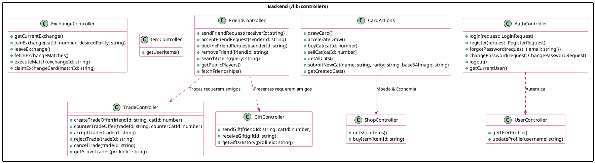

# Visão Geral dos Controladores no Backend

O backend do Catcha está totalmente contido dentro do diretório `/lib/controllers`. Ele utiliza Next.js Server Actions para interagir com segurança com o banco de dados Supabase. Esses controladores atuam como ponte entre a interface (UI) no lado do cliente e o banco de dados, aplicando lógica de negócios, validações e Row-Level Security (Segurança a Nível de Linha).

## Diagrama de Classes PlantUML

O diagrama a seguir ilustra os principais módulos dentro do diretório `/lib/controllers` e suas responsabilidades chaves.

## Módulos Principais

### 1. AuthController
Lida com todos os fluxos de autenticação do usuário, incluindo login, registro, recuperação de senha e gerenciamento de sessão. Ele interage diretamente com o Supabase Auth.

### 2. UserController
Busca e atualiza os dados do perfil do usuário, incluindo a contagem global de notificações (trocas pendentes, presentes não lidos, pedidos de amizade) usados na barra de navegação.

### 3. CardActions
Gerencia o loop central do jogo: sorteio de cartas sob um tempo de espera (cooldown), utilização de itens para acelerar esse tempo e compra/venda de cartas repetidas por moeda no jogo. Também lida com a submissão de novos gatos pelos usuários.

### 4. TradeController & GiftController
Aplica a regra de limite de 1 troca ativa globalmente. Lida com a oferta de cartas, negociação de contrapropostas e execução segura da dedução atômica das cartas. A lógica de presentes apresenta um tempo de espera automático para prevenir spam.

### 5. ShopController & ItemController
Gerencia a economia no jogo, permitindo aos usuários gastar moedas ganhas em itens consumíveis que pulam o tempo de espera do sorteio.

### 6. ExchangeController
Lida com eventos cronometrados globais onde os jogadores colocam cartas de raridades menores em um pool para possivelmente encontrar um par correspondente e receber cartas das raridades maiores desejadas. Inclui mecânicas de resgate e rastreamento de status.
