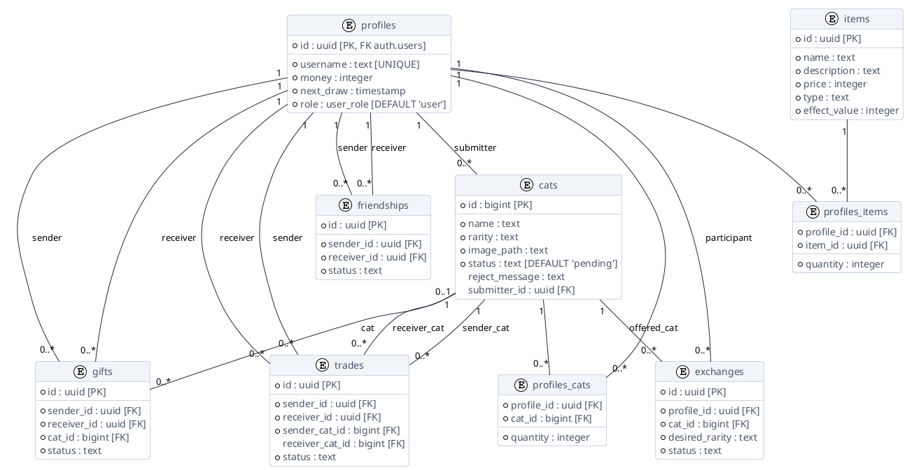

# Esquema do Banco de Dados

O banco de dados depende do PostgreSQL hospedado pelo Supabase. A segurança e a integridade dos dados são aplicadas no nível do banco de dados por meio de restrições rígidas de Chaves Estrangeiras e políticas de Row Level Security (RLS).

## Diagrama Entidade-Relacionamento (ERD)

Abaixo encontra-se a modelagem visual completa da estrutura de tabelas, baseada estritamente nas migrações do Supabase:

## Tabelas Principais

### `profiles`
Armazena dados do usuário e estado do jogo.
- `id` (UUID): Faz referência a `auth.users(id)`.
- `username` (Text): Nome de exibição único.
- `money` (Integer): Saldo de moeda do jogo.
- `next_draw` (Timestamp): A hora exata em que o usuário tem permissão para sortear uma nova carta gratuitamente.
- `role` (user_role): Enum personalizado (`user`, `admin`, `superadmin`). Restrito e gerido pelas lógicas do backend.

### `cats`
O catálogo central de todas as cartas possíveis no jogo.
- `id` (BigInt): Chave primária autoincremento.
- `name` (Text): Nome do gato.
- `rarity` (Text): Define o valor e o peso/chance de drop (ex.: Comum, Rara, Lendária).
- `image_path` (Text): Caminho para a imagem no bucket do Supabase Storage.
- `status` (Text): Status da carta (`pending`, `approved`, `rejected`).
- `reject_message` (Text): Motivo de rejeição para submissões negadas.
- `submitter_id` (UUID): Referência a `profiles(id)` para quem criou a carta.

### `profiles_cats`
Uma tabela pivot para relação muitos-para-muitos representando o Álbum (Inventário de Gatos) de um usuário.
- `profile_id` (UUID): O proprietário.
- `cat_id` (BigInt): A carta possuída.
- `quantity` (Integer): Quantidade de duplicatas. Um trigger ou validação RLS deleta o registro quando cai para 0.

## Tabelas da Loja e Eventos

### `items`
Tabela estática de itens consumíveis disponíveis para compra na loja do jogo.
- `id` (UUID)
- `name`, `description`, `price`, `type`
- `effect_value` (Integer): Ex.: o número de horas em milissegundos a serem descontadas do `next_draw`.

### `profiles_items`
Acompanha os itens consumíveis no inventário do usuário.
- `profile_id` & `item_id` (UUID)
- `quantity` (Integer)

### `exchanges`
Tabela de intercâmbio/venda cega de cartas. Os usuários depositam uma carta e definem uma raridade desejada.
- `profile_id` (UUID)
- `cat_id` (BigInt)
- `desired_rarity` (Text)
- `status` (Text)

## Tabelas Sociais (P2P)

### `friendships`
- `id` (UUID)
- `sender_id` & `receiver_id` (UUID)
- `status` (Text): 'pending', 'accepted', 'declined'

### `trades`
Registra os acordos de trocas diretas ativas e finalizadas.
- `id` (UUID)
- `sender_id` & `receiver_id` (UUID)
- `sender_cat_id` & `receiver_cat_id` (BigInt): As cartas propostas na negociação.
- `status` (Text): 'pending', 'countered', 'completed', 'cancelled', 'rejected'.

### `gifts`
Registra presentes de cartas de um jogador para outro.
- `id` (UUID)
- `sender_id` & `receiver_id` (UUID)
- `cat_id` (BigInt)
- `status` (Text): 'pending' (não resgatado) ou 'received' (resgatado).
